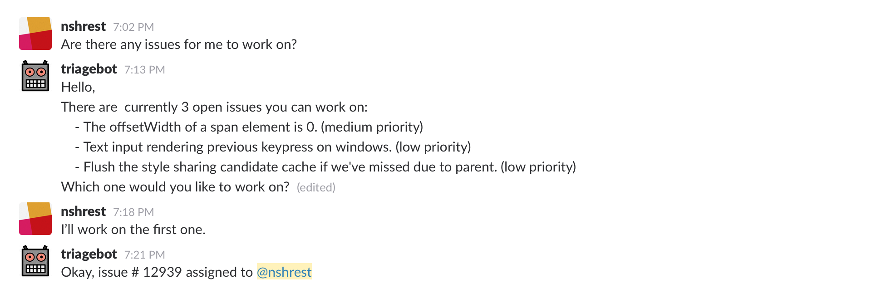
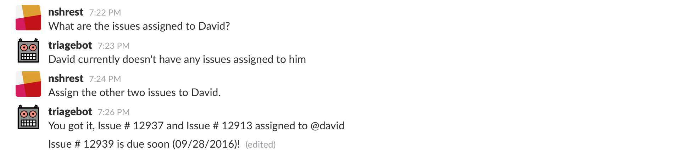
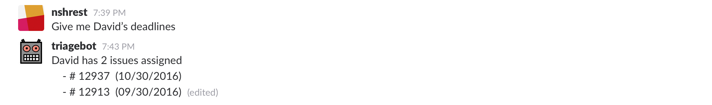

#Design Milestone

###Problem Statement

There is a friction involved in allocating tasks to software developers when working with any project involving multiple members. Why is task allocation a problem? Here are some of the common challenges that hinder project management: 

  - A lot of time that is wasted in manually browsing and delegating the tasks appropriate to the developer team members.
  - Reassigning a task to the next available developer so they can resume the task quickly
  - Making sure all developers have at least one task to do at all times to keep the project moving (easy)
  - Give the developer tasks sorted by priority according to the current sprint deadline (relatively easy)

These challenges need to be addressed so that software developers can work efficiently and effectively.

### Bot Description 

The bot is designed to solve the challenges that were listed above in order to allocate tasks efficiently and appropriately to the developers that can resolve the issues or complete the tasks in a reasonable time. To reduce time wasted in manually looking up issues and assigning them to the appropriate developers, the bot will allow the developer to fetch a list of issues sorted by priority. Reassigning a task to the next available developer will also be easy since the bot will have a list of developers who haven’t been assigned any issues. This will also takes care of the problem of keeping developers productive by having at least one task to do at all times. The bot will ask whether they can take on the issue before assigning it. Developers can then accept or reject the issue with a reason so the assigner can find someone else. For maximum productivity the bot will be making sure developers are working on higher priority issues for the current sprint, and according to the kinds of issues that they are skilled at solving; this will be based on the history of the types of issues that they have closed out. The bot will also provide a functionality to match the issues and the developers based on their past experiences.

A bot is a good solution for several reasons: a bot can automatically process background tasks that are tedious for the developers; a bot can converse with the developers to do things step by step in real time, which provides the developer flexibility in assigning tasks or taking on tasks proactively; it’s a natural interface than simply running scripts on a terminal which provides an easier way to execute commands and makes them more memorable. This bot would best fit into the DevOps bot category since it is handling common developer tasks.

### Design Sketches 

#####Wireframe:

#####Storyboard: 

- Developers can look for open issues and assign them to themselves. The issues will be linked to the respective Github issues. The developer can ask the bot for open issues to work on. He’d use natural language, and the bot would look for keywords like “issue” or “work”. It then understands that the developer is asking for the open issues that fit his expertise.
The bot would then list the issues for the developer and wait for a response. The developer would respond with a phrase that indicates which issue he wants to work on. He would say something like, “I want the first one” or “number 1”. 
The bot would respond with a confirmation that the chosen issue was assigned to that developer.

- Developers can also assign issues to other developers in the team in case they need help with the work that they're currently working on or wanting to delegate tasks to others. Before they start assigning issues, they can also ask TriageBot the issues that the assignee is currently working on to which the bot will respond with a list of issues assigned to that developer. When the developer requests issues to be assignee, the asignee has an option to review the issues before accepting or rejecting the assignment.

- Remembering deadlines can be tough, so TriageBot will also push notifications to the developer with helpful reminders of the deadline for issues. Everyday, the bot will look into the database of issues and based on the milestone of those issues, it can remind the developers at an appropriate time and appropriate frequency.

- Developers can also ask TriageBot for the deadlines of either their issues or other developers in their team. The developer would make the request to view their deadlines and the bot would look for keywords including “deadline” or “timeline” along with the name of the developer or the issue’s ID number. The bot will then refer to the database on Github to pull the information and respond back to the developer’s request. This helps the developer gauge the issues they need to get done, or what other developers are working on before assigning them issues according to sprint deadlines.

### Architecture Design 

The bot’s architecture best represents a repository architecture pattern, where the data for developers’ past issues and issue information are being pulled more often than pushed to Github. The frontend of the bot architecture is the Slack UI, which will be used by the developers to communicate and assign issues to each other. Node.js will serve as the backend, making use of a third-party library called BotKit to listen to and process commands issued by the developer and to push notifications and reminders like upcoming deadlines. 

The Github REST API is the API Gateway between Node.js and the Github service’s database where the repository for the project is stored. The Node.js script will call the Github REST API to gather information about the open issues and the history of solved issues for the developers and run an algorithm on them and come up with the best possible match. 

The initial configuration required by the application would be stored in the xml and will be loaded when the application starts up. 

Constraints or guidelines that should be established in building software for your architecture:
- The act of closing an issue means they solved it
- The type of priority of issues include high, medium and low 
- Priority level of issues is calculated on deadlines and git issue’s label(s)
- There are fixed number of labels.
- Each individual issue is assigned appropriate label(s) by the developer(s).
